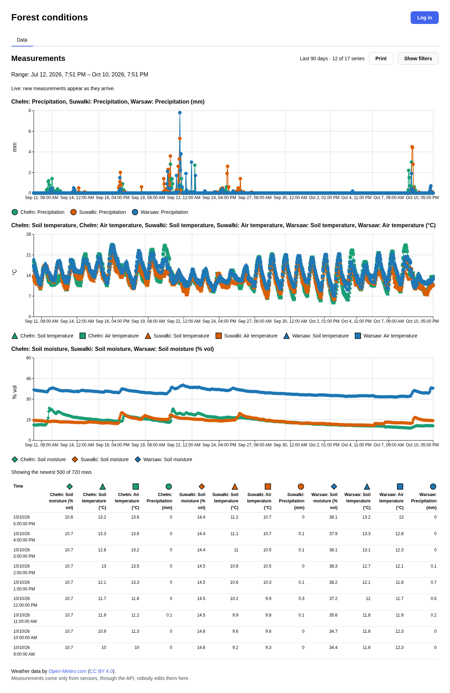
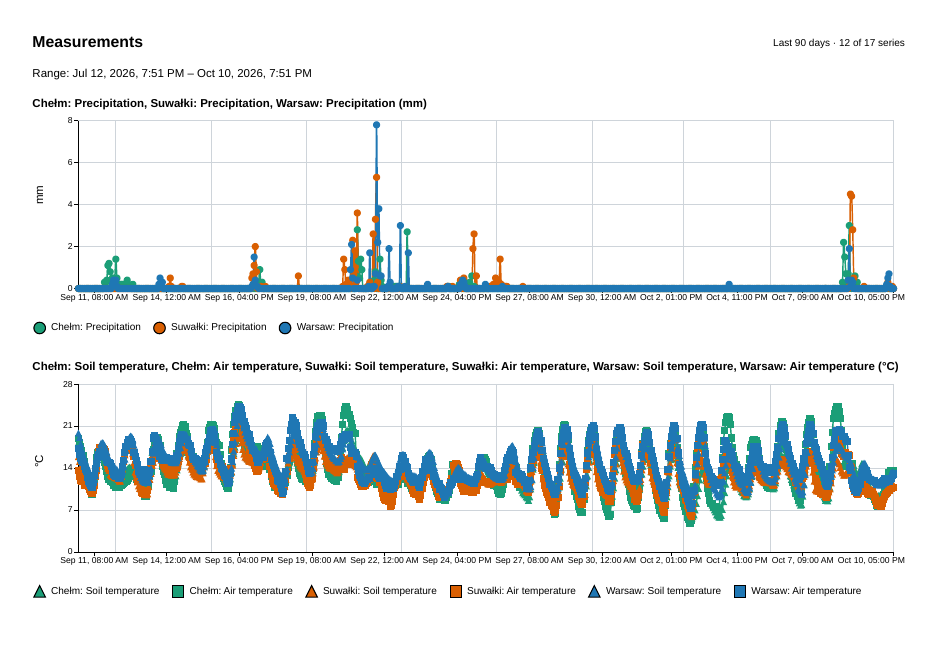
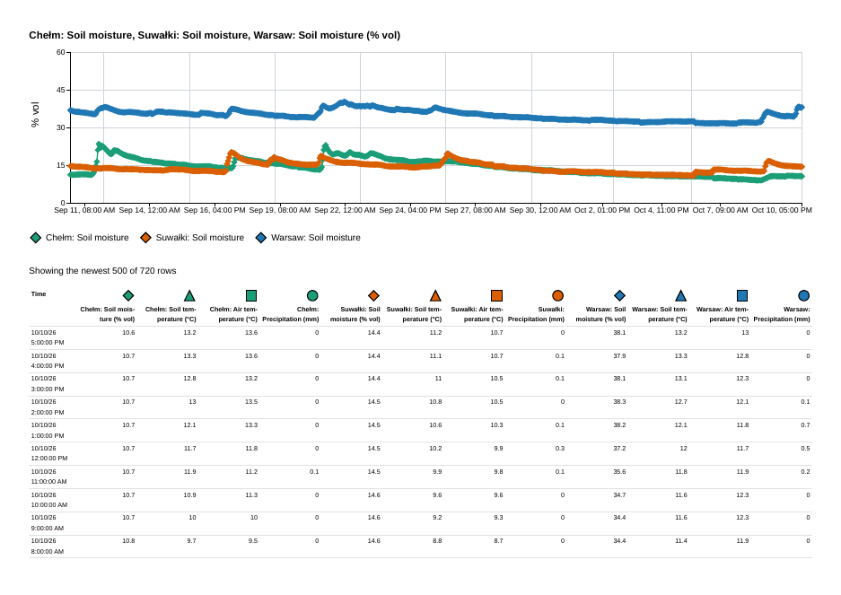
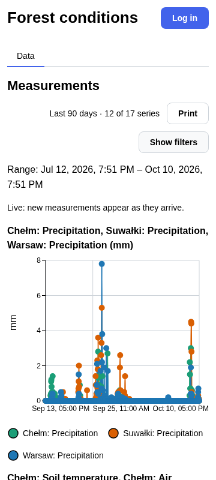

# Forest conditions

How wet and warm is the forest right now, and how was the last week? This app collects
**precipitation, air temperature, soil temperature and soil moisture** for three places —
**Warsaw, Suwałki and Chełm** — and shows them as charts and a table you can read, filter and
print.

Why these numbers: mushrooms fruit about one to two weeks after a good rain, in wet and warm
soil, and stop after a frost. The history here is the weather record behind
[grzyby-mcp](https://github.com/Manomenu/grzyby-mcp), a mushroom-finding assistant.

**Address:** https://pomiary-lasy.gugnowski.com — the app is being deployed there; if the page
does not answer yet, it is not up yet.

## What you can do

**As a reader** (no login):

- See one chart per unit (mm, °C, % vol), each series in its own colour and marker shape, and
  the same values in a table underneath.
- Pick a range: 15 minutes, 3 hours, 24 hours, 7, 30 or 90 days, or exact dates.
- Switch series on and off, one by one or a whole unit at a time.
- Click a table row to see that moment highlighted on the charts.
- Watch new values appear on their own, without reloading.
- Print the page: charts and every column of the table fit on paper, without buttons.
- Use it on a phone: the layout adapts, and the table scrolls sideways.

**As the administrator** (after logging in):

- Add, change and delete series: name, unit, allowed range, colour and marker.
- Register sensors for a series. A sensor's key is shown **once**, when it is created.
- Change your password.

Nobody can edit a measurement: values arrive only from sensors, through the API.

## Where the data comes from

The "sensors" are a small program, the **sensor emulator**, that sends values to the app the
way a real device would. By default it reads hourly model data from
[Open-Meteo](https://open-meteo.com/) (Weather data by Open-Meteo.com, CC BY 4.0) for the
three places; it can also make a synthetic curve. How to run it:
[pomiary_generator/README.md](pomiary_generator/README.md).

## What it does not know

- These are **model data for a place**, not readings from a weather station in a forest.
- Only the three places above, and only the four quantities.
- The app shows the past and the present; it does not forecast.

## For the course

A project for Advanced Web Applications (ZAI, 26Z). Status of every requirement:
[docs/requirements.md](docs/requirements.md); what was done in each stage:
[docs/progress/](docs/progress/); the graded documentation is the PDF built from
[docs/documentation.md](docs/documentation.md) — this README is not that document.

Developers: [docs/development.md](docs/development.md)
