# Pomiary — forest conditions: documentation (ZAI 26Z, final submission E2)

An application that collects and shows measurement series from sensors: precipitation, air and
soil temperature and soil moisture in three places near forests (Warsaw, Suwałki, Chełm) —
12 series, hourly values. The sensors are emulated by a data generator that reads
[Open-Meteo](https://open-meteo.com/) (Weather data by Open-Meteo.com, CC BY 4.0) or makes a
synthetic curve, and sends the results through the API like any sensor.

> Source of the PDF (at most 8 pages). The ERD image is `docs/erd.svg`; the longer ERD text is
> `docs/erd.md`. Items marked TODO are filled in at submission.

## 1. Application address and repository

- Application and API (one host, the API under `/api`): https://pomiary-lasy.gugnowski.com
  — **TODO before submission: confirm it is deployed and reachable** (state it here with the
  date). The application runs on the author's own Kubernetes cluster behind a Cloudflare
  Tunnel (HTTPS), not on a free plan, so it is not put to sleep after inactivity and there is
  no cold start to report.
- API documentation (Swagger UI): `/api/docs` on the same host (checked behind nginx, the way the
  deployment serves it); the contract is `docs/spec/zai-api-26z.yaml`.
- Repository: https://github.com/Manomenu/zaawansowane-aplikacje-internetowe-2026Z
  (branch `master`; CI status:
  https://github.com/Manomenu/zaawansowane-aplikacje-internetowe-2026Z/actions/workflows/ci.yml).

## 2. Administrator login

| | |
| --- | --- |
| Username | **TODO before submission** |
| Password | **TODO before submission** (given only in the submission form; never kept in the repository) |

## 3. Running locally

### 3.1 Tool versions

| Tool | Version | Used for |
| --- | --- | --- |
| Python | 3.14 (`.python-version`; the image is `python:3.14-slim`) | server |
| uv | current | Python dependencies (`uv sync`) |
| Node.js | 24 (the web image builds on `node:24-alpine`) | web app |
| pnpm | 11.24.0 (`packageManager` in `pomiary_web/package.json`, via corepack) | web dependencies |
| PostgreSQL | 17.11 (`postgres:17.11` in `compose.yaml` and `just db up`) | database |
| nginx | 1.29 (`nginx-unprivileged:1.29-alpine`) | serves the web build, proxies `/api` |
| just, podman + `podman compose` | current | commands, local database and container stack |
| Generator | Python 3.12 or newer, standard library only | `pomiary_generator/` |

Stack: FastAPI + psycopg 3 with plain SQL (no ORM) + Argon2 (argon2-cffi); React 19 + Mantine +
Recharts + Vite, TypeScript strict.

### 3.2 Commands

From the repository root, after cloning:

```sh
just sync        # Python and web dependencies from the lockfiles, git hooks
cp pomiary_server/.env.example pomiary_server/.env
                 # then uncomment and set ADMIN_USERNAME and ADMIN_PASSWORD in it
just db up       # PostgreSQL on localhost:5453 (a podman container)
just server      # API on http://localhost:6220 (Swagger UI at /docs); migrations run at start
just web         # web app on http://localhost:3220, proxies /api to the server
```

The first administrator is created at the server's start-up from `ADMIN_USERNAME` and
`ADMIN_PASSWORD` in `pomiary_server/.env` (only when no administrator exists yet); log in with
those. The development server answers without the `/api` prefix; the web dev server and nginx
add and strip it.

Alternatively the whole stack in containers, the same images the cluster runs, with no other
tool than podman: `just up` → http://localhost:8092 (login `admin` / `local-only-password`, set
in `compose.yaml` for this local stack only); `just down` stops it. Checks: `just check` (the
quality gate: linters, types, unit tests, the teacher's contract tests against a local server),
`just e2e` (browser tests).

### 3.3 The data generator (`pomiary_generator/`, F13)

It talks to the API only, with a sensor's key; it never touches the database. The key is
shown once when a sensor is registered in the admin panel. Address and credentials may come
from the environment (`POMIARY_API`, `POMIARY_API_KEY`, `POMIARY_ADMIN_USER`,
`POMIARY_ADMIN_PASSWORD`) so they stay out of the shell history and the repository.

```sh
cd pomiary_generator && python -m pomiary_generator send --help     # or: just generator send --help
```

**`send`: one sensor.** Backfill (`--count N`, past timestamps) or live (`--interval 5s`, the
server stamps the time).

| Parameter | Meaning |
| --- | --- |
| `--api URL`, `--api-key KEY` | API address and the sensor's key (envs above); a missing key is an error |
| `--count N` | values to send (backfill) or number of sends (live; without it, forever) |
| `--step 1h` | backfill: time between values (`s`, `m`, `h`, `d`; default `1h`) |
| `--end now` | backfill: time of the newest value (ISO 8601 or `now`) |
| `--interval 5s` | live mode: time between sends |
| `--source synthetic\|open-meteo` | where values come from (default `synthetic`) |
| `--shape constant\|random\|sine\|random-walk` | synthetic: curve (default `random`) |
| `--min A`, `--max B` | synthetic: range (default 0 and 100); values never leave it |
| `--period 24h`, `--noise X`, `--seed N` | synthetic: sine wavelength, noise, reproducible values |
| `--place warsaw\|suwalki\|chelm` | open-meteo: place |
| `--quantity precipitation\|air-temperature\|soil-temperature\|soil-moisture` | open-meteo: quantity |
| `--dry-run` | print what would be sent, send nothing |

A rejected value (400/422) is printed with the server's explanation and the run goes on; a 401
(bad key, or the sensor was unregistered) stops it; the exit code is non-zero when anything
failed. Example — an out-of-range value for the demonstration of F4:
`python -m pomiary_generator send --count 1 --shape constant --min 120 --max 120`.

**`seed`: the sample data (F11).** Logs in as the administrator, creates the 12 series (3 places
× 4 quantities) if missing, registers one sensor per series and sends `--days` of hourly values
with that sensor's key. A series that already has measurements is skipped, so a second run
duplicates nothing. The sensors' keys are printed once, at the end.

```sh
export POMIARY_ADMIN_USER=admin POMIARY_ADMIN_PASSWORD=...
python -m pomiary_generator seed --api http://localhost:8092 --days 30     # about 8 600 requests
```

| Parameter | Meaning |
| --- | --- |
| `--api`, `--user`, `--password` | API address and administrator (envs above) |
| `--days 30` | days of hourly values per series |
| `--source open-meteo\|synthetic` | default `open-meteo`; `synthetic` when the service is down |

## 4. Database: ERD



PostgreSQL, schema in `pomiary_server/pomiary_server/migrations/001_schema.sql` (migrations are
numbered SQL files applied at start-up and checksummed; the sample data comes from the
generator). Details: `docs/erd.md`.

- **`admins`** — accounts; `username` unique, `password_hash` is Argon2id.
- **`sessions`** — login sessions; the key is `token_hash`, the SHA-256 of the opaque token;
  `expires_at` bounds its life.
- **`series`** — name, range `[min_value, max_value]` (`CHECK min_value < max_value`), colour
  (`CHECK` `#RRGGBB`), optional `icon` (chart marker) and `unit`.
- **`sensors`** — a registered sensor bound to one series; `api_key_hash` is the unique SHA-256
  of its key; `last_measurement_at`.
- **`measurements`** — `value`, `measured_at` (API: `timestamp`), the series and, when known,
  the sensor.

| Relationship | Cardinality | ON DELETE |
| --- | --- | --- |
| `admins` → `sessions` | 1–N | CASCADE: no session without its admin |
| `series` → `sensors` | 1–N | CASCADE: deleting a series unregisters its sensors |
| `series` → `measurements` | 1–N | CASCADE: results vanish only with their series (contract) |
| `sensors` → `measurements` | 0..1–N, nullable | SET NULL: unregistering stops the key at once, the history stays |

Index `(series_id, measured_at)` on `measurements` serves `GET /measurements?series=&from=&to=`
(equality on the series, a range scan over time, already ordered). Passwords, session tokens and
sensor keys are stored only hashed.

## 5. Two security elements (T5, B3)

### (a) Sensor API keys: random, stored as SHA-256, shown once (T5.5)

- **What.** A sensor authenticates with the header `X-API-Key`. The key is
  `secrets.token_urlsafe(32)` — 43 characters from a cryptographic random generator (256 bits;
  the contract requires at least 32 characters). The database keeps only `sha256(key)` in
  `sensors.api_key_hash` (`UNIQUE`). The raw key is returned once, in the response to
  `POST /sensors` (field `apiKey`), and shown once in the web app (a dialog with a copy button);
  no route returns it again.
- **Where.** `pomiary_server/pomiary_server/sensors/store.py`: `create_sensor` (generates the
  key, stores `key_hash(key)`), `key_hash`, `sensor_for_key` (looks the sensor up by the hash).
  `measurements/api.py`: `current_sensor`, the dependency of `POST /measurements`; the series is
  taken from the sensor, never from the body, and an administrator's Bearer token alone is 401.
  Web: `pomiary_web/src/sensors/KeyModal.tsx`.
- **Protects against.** A stolen copy of the database or a backup: the hashes cannot be turned
  back into keys, so nobody can post fake measurements. A 256-bit random key cannot be guessed
  or enumerated, which is why a fast hash (SHA-256) is enough here, unlike for passwords.
  Unregistering deletes the row, so the key stops working at once (401); the measurements stay
  with `sensor_id = NULL`.

### (b) Passwords with Argon2id and opaque session tokens with expiry (T5.1, T5.3)

- **What.** Passwords are hashed with Argon2id (`argon2-cffi`, RFC 9106 default parameters,
  a random salt inside the hash string). A login (`POST /auth/login`) returns an opaque random
  token (`secrets.token_urlsafe(32)`) valid for `TOKEN_TTL_SECONDS` (default 3600 s, returned as
  `expiresIn`); the database keeps only its SHA-256 and the expiry. Every protected request
  looks the token up with `expires_at > now()`. Logout deletes the session; a password change
  ends all the other sessions of that administrator.
- **Where.** `pomiary_server/pomiary_server/auth/store.py`: `hasher` (`PasswordHasher`),
  `verify_password`, `UNKNOWN_USER_HASH`, `open_session` (also deletes expired sessions),
  `token_hash`, `admin_for_token`, `close_session`, `change_password`. `auth/api.py`:
  `current_admin` — the `CurrentAdmin` dependency every modifying route declares.
- **Protects against.**
  - *A stolen database copy:* passwords are salted, memory-hard Argon2id hashes (expensive to
    brute-force), and session tokens are stored only as SHA-256, so a dump yields no usable
    login.
  - *Replay of a token after logout or a long time later:* an opaque token is revoked by
    deleting its row, which a stateless JWT cannot do without a blocklist; it also expires on
    its own.
  - *Learning which usernames exist from response time:* for an unknown username the server
    still verifies the password against `UNKNOWN_USER_HASH`, so "no such user" costs the same as
    "wrong password" and the answer is the same 401.
  - No cookies are set, so there is nothing for CSRF to ride on; the web app keeps the token in
    `sessionStorage` and sends it in `Authorization: Bearer`.

### The other three T5 items

- **Parameterized queries (T5.2):** every query in the `store.py` modules passes values as
  `%s` parameters to psycopg; the only f-strings put constant column lists into the SQL.
- **Authorization of every modifying operation on the server (T5.4):** each POST/PUT/DELETE of
  series and sensors, logout and password change depend on `CurrentAdmin`
  (`series/api.py`, `sensors/api.py`, `auth/api.py`); measurements can only be posted with a
  sensor key (`current_sensor`); authentication is checked before the body is validated. Hiding
  the tabs in the UI is only a convenience. Pytest covers each route without a token.
- **Session/token mechanism (T5.3)** is item (b) above. Besides: every API response carries
  `X-Content-Type-Options: nosniff`, a restrictive `Content-Security-Policy` and
  `Referrer-Policy` (`problems.py`); nginx adds the page's CSP (`pomiary_web/nginx.conf.template`).

## 6. Extensions of the API contract

The contract (`docs/spec/zai-api-26z.yaml`) is unchanged (its checksum is checked by the quality
gate); everything below is on top of it.

- **Added path `GET /api/measurements/stream`** (public, `text/event-stream`, Server-Sent
  Events) — live measurements for the dashboard (extension X1). Optional `?series=1,3` (same
  parsing as `GET /measurements`). Each new measurement is an event `measurement` whose `data`
  is the same JSON as `GET /measurements/{id}`; a `: ping` comment every 15 s keeps the
  connection alive. A measurement is announced only after it is committed (PostgreSQL
  `LISTEN/NOTIFY`). More than `MAX_STREAMS` (default 50) open streams get `503` with
  `Retry-After`. `Accept: text/event-stream` is accepted on this route only.
- **No fields added.** `icon`, `unit` (series), `sensorId` (measurement), `createdAt` and
  `lastMeasurementAt` (sensor) and `apiKey` (in the registration response) are all part of the
  contract; the server fills `sensorId`, `createdAt` and `lastMeasurementAt`, which the contract
  marks optional. Only the stream path above is new.
- **Stricter than the contract allows at minimum:**
  - a `timestamp` (body and `from`/`to`) must carry a zone offset (`Z` or `+02:00`); one
    without is 400 rather than a guessed UTC; a number is not taken for a Unix time;
  - numbers are strict JSON numbers (`"5"` and `true` are refused, NaN/Infinity too);
  - a measurement is rejected (422) when the value is outside the series' range (bounds
    inclusive) or the timestamp is more than 5 minutes ahead, and the rejection is logged at
    WARNING with sensor, series and value;
  - changing a series' range so that stored measurements fall outside is 409;
  - every error is `application/problem+json` (RFC 9457) with `errors: [{field, message}]` for
    validation; unsupported `Accept` is 406, a body that is not JSON is 415, `PUT`/`PATCH`/
    `DELETE` on a measurement is 405;
  - security headers on every API response (section 5).

## 7. Use of AI tools

AI assistants were used, as the course allows:

- **Claude Code** (Anthropic): the model **Claude Opus 5.5** for planning, design decisions,
  code review and integration, and **Claude Sonnet 5.5** in subagents that implemented
  well-defined steps. Used for writing the server, the web app, the data generator, tests,
  the CI and deployment configuration and this documentation.
- **suwgit** with a local language model (Qwen) writes the commit messages.

The author gave the tasks, reviewed the results, ran the checks and **is responsible for all
the submitted code, including its correctness and security**. The code quality gate (types,
linters, unit, contract and browser tests) is run on every change.

## 8. Technologies and why (T1–T4)

- **T1 Python + FastAPI:** pydantic validation gives the 400/422 distinction and the OpenAPI
  document, from which the web app generates its TypeScript types.
- **T2 React 19 SPA + Mantine + Vite:** responsive layout with CSS Grid and media queries in
  `pomiary_web/src/app.css`; one folder per feature under `src/`.
- **T3 REST conforming to the contract:** the teacher's test script runs against a local server
  in the quality gate.
- **T4 PostgreSQL, plain SQL migrations:** typed columns, primary and foreign keys, `CHECK`
  constraints, the time index; no ORM, so the queries are explicit. Chosen over SQLite for
  concurrent writers and `LISTEN/NOTIFY` (the live stream), and it can take TimescaleDB later.

## 9. Extensions done

- **X1 live chart (SSE):** `GET /api/measurements/stream` (section 6) and the dashboard in
  `pomiary_web/src/dashboard/` — a value sent by the generator appears without reloading.
- **X2 generator with real data:** `--source open-meteo` (section 3.3), code in
  `pomiary_generator/`; attribution in the page footer and in the README.
- **X3 tests in CI:** `.github/workflows/ci.yml` runs the quality gate, the browser tests and
  then builds the images (status: **TODO link**).
