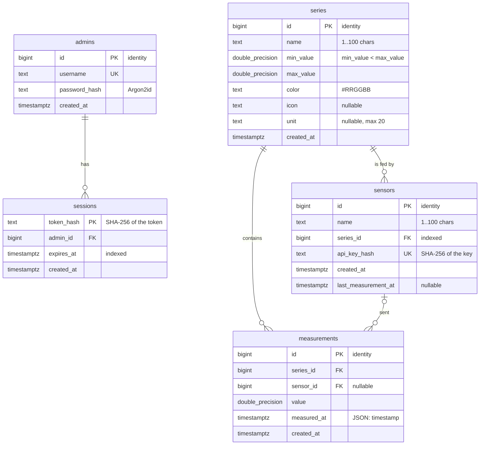

# Database schema (ERD)

PostgreSQL 17, created by `pomiary_server/pomiary_server/migrations/001_schema.sql` (the SQL
script and the migration are the same file; later changes arrive as new numbered files). The
picture below is also rendered to [`erd.svg`](erd.svg) for the PDF documentation.

(`double_precision` stands for the type `double precision`; Mermaid does not accept a space in
a type name.)

## Tables

- **`admins`** — administrator accounts. `username` is unique. `password_hash` holds an
  Argon2id hash (salt and parameters inside the string), never the password. The first
  administrator is created at start-up from `ADMIN_USERNAME` / `ADMIN_PASSWORD` when the table
  is empty.
- **`sessions`** — login sessions of administrators. The primary key is `token_hash`, the
  SHA-256 (hex) of the opaque Bearer token: the token itself is never stored. `expires_at` is
  checked on every request (index `sessions_expires_at_idx` serves the clean-up of expired rows
  done at login). Logout deletes the row, which revokes the token at once.
- **`series`** — a measurement series: name (1–100 characters), the allowed range
  `[min_value, max_value]` (`CHECK min_value < max_value`), a colour `#RRGGBB` (`CHECK` with a
  regular expression), and the optional marker `icon` and `unit` (at most 20 characters).
- **`sensors`** — a registered sensor, bound to exactly one series. `api_key_hash` is the
  SHA-256 (hex) of its API key and is unique; the key is shown once, at registration.
  `last_measurement_at` is updated with every accepted measurement. Index
  `sensors_series_id_idx` serves "the sensors of a series".
- **`measurements`** — one result: `value` and `measured_at` (the API field `timestamp`),
  the series it belongs to and, when known, the sensor that sent it. There is no update or
  delete path in the API; rows disappear only with their series.

## Relationships

| Relationship | Cardinality | ON DELETE | Why |
| --- | --- | --- | --- |
| `sessions.admin_id` → `admins.id` | one admin, many sessions (1–N) | `CASCADE` | a session means nothing without its admin |
| `sensors.series_id` → `series.id` | one series, many sensors (1–N), NOT NULL | `CASCADE` | a sensor exists only to feed a series; deleting the series unregisters its sensors |
| `measurements.series_id` → `series.id` | one series, many measurements (1–N), NOT NULL | `CASCADE` | the contract says results vanish only together with their series |
| `measurements.sensor_id` → `sensors.id` | one sensor, many measurements (0..1–N), nullable | `SET NULL` | unregistering a sensor must stop its key at once, but the history it measured stays |

A measurement therefore reaches its series directly (`series_id`), not through the sensor: it
stays attached to the series after the sensor is gone.

## Index for time queries

`measurements_series_id_measured_at_idx` on `(series_id, measured_at)` serves the main query,
`GET /measurements?series=…&from=…&to=…&sort=…&limit=…`: the series filter is an equality on
the first column, and the closed time interval `from ≤ timestamp ≤ to` with the ordering is a
range scan on the second, so PostgreSQL reads only the wanted slice, already sorted.

## What is stored hashed

- Passwords: Argon2id (`admins.password_hash`).
- Session tokens: SHA-256 of the token (`sessions.token_hash`).
- Sensor API keys: SHA-256 of the key (`sensors.api_key_hash`).

A copy of the database therefore contains no password, token or key that could be used to log
in or to send measurements.
